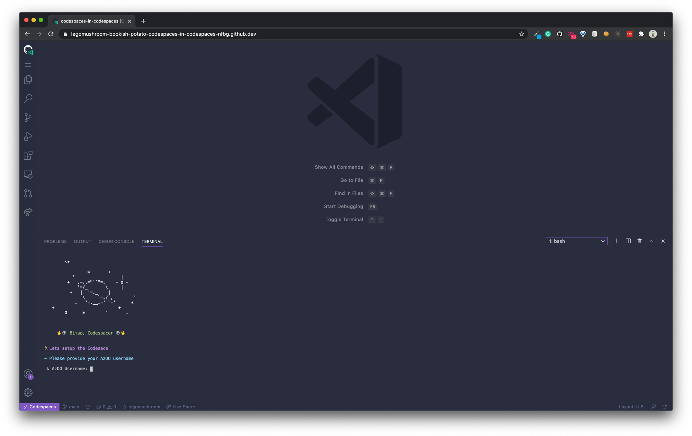
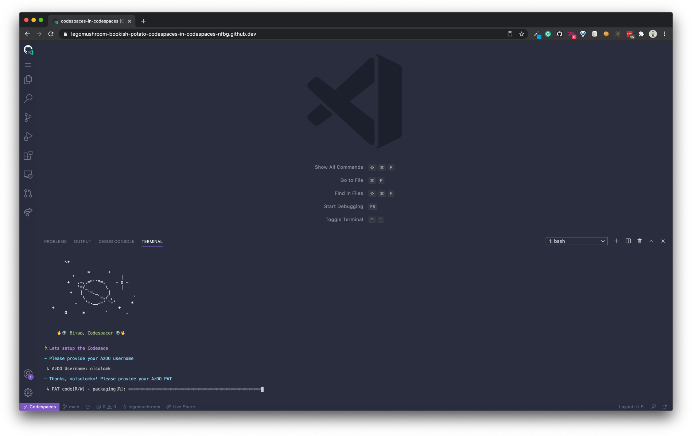
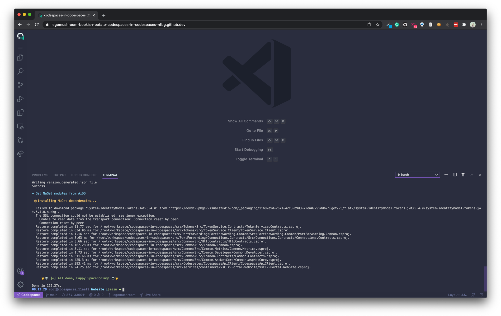

# Codespace in Codespace

[](https://github.com/features/codespaces)

Codespaces Workbench inside a GitHub Codespace.

## Use

### 1. Open with Codespaces.

### 2. Once the codespace is initialized and connected (the terminal should be colorful):

```bash
script/bootstrap
```

This will initialize interactive flow in the terminal to pull the `vsclk-core` repo from the Azure DevOps and
settings up the `npm`/`nuget` credentials:

- On the first step it will ask for your AzureDevOps alias:



Type you `AzureDevOps` alias or `email` and press enter.

- Next, it will ask you for `AzureDevOps` PAT, the token should have `Code [read/write] and Packaging[read]` scopes, paste the token and press `enter`:



- ⛱️ _Relax and enjoy_. The bootstrap script will take it from here. If the credentials have the correct premissions, the script will:

  - pull down the `vsclk-core` repo that hosts the workbench source code
  - set up the `npm` and `nuget` credentials to auth with `AzureDevOps` private module feeds
  - pull down and install all the `npm`/`nuget` dependencies

- After the boostrapping is complete you will see the welcoming message at the end of the finished process:



### 3. Running the workbench

After the bootstraping is complete, you are left in the `Website` folder, that is the folder that contains the workbenhc client and used as entry point to start the app.

User yarn to start the app:

```bash
yarn start
```

This will start the workbench app on port `5000`, after you see it fully started.
